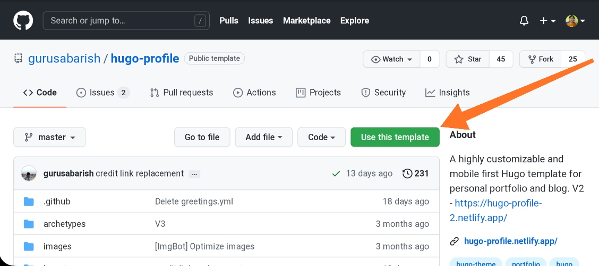
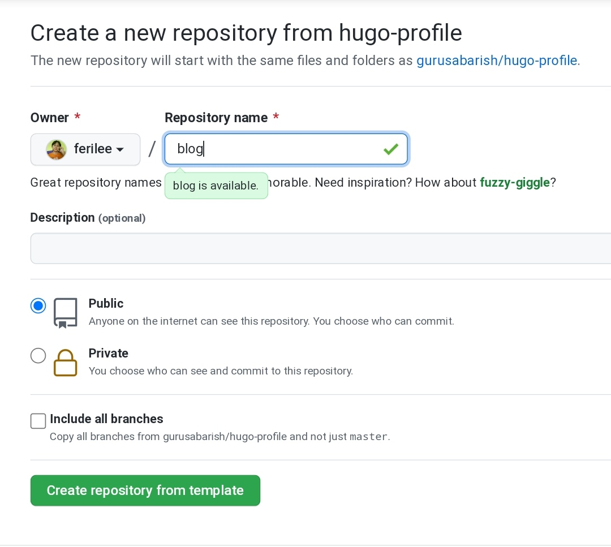

+++
author = "Ferilee"
title = "Membuat Personal Website dengan Hugo"
date = "2021-09-17"
description = "Framework pembuat website tercepat di dunia."
tags = ["hugo", "website"]
categories = ["web design"]
series = ["Themes Guide"]
aliases = ["migrate-from-jekyl"]
image = "hugo-logo-wide.png"
+++

# Hugo
## Tema Hugo Profile
https://github.com/gurusabarish/hugo-profile
### Langkah-langkah
\
\
\
\
\
\
\
\
\
\
\
\
\
\
