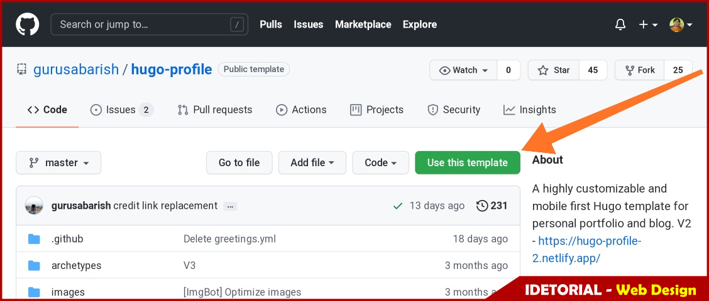

 +++
author = "Ferilee"
title = "Membuat Personal Website dengan Hugo Static Site Generator"
date = "2021-09-17"
description = "Framework pembuat website tercepat di dunia."
tags = ["hugo", "website"]
categories = ["idetorial","web design"]
series = ["Themes Guide"]
aliases = ["migrate-from-jekyl"]
image = "hugo-logo-wide.png"
+++

## Pengantar
Memiliki website pribadi (***personal website/blog***) di zaman sekarang sangatlah penting. Selain sebagai identitas di dunia maya, memiliki website juga dapat menambah rasa percaya diri karena tulisan Anda akan diketahui dan dikenal oleh banyak orang di seantero jagad maya hehehee ...
<!--more-->

Pandemi Covid-19 membawa dampak yang luar biasa di semua bidang kehidupan. Pandemi juga mengubah cara kita berinteraksi dengan dunia yaitu menggunakan internet. Lihatlah transformasi digital yang akhir-akhir ini sedang mengubah pola pikir dan kehidupan kita. Terciptanya *marketplace* yang memanjakan konsumen hingga _e-course_ yang membantu memberikan edukasi tanpa sekat ruang dan waktu bagi para pelajar. Sebagian besar memanfaatkan website sebagai media bisnis dan sarana pendidikan.

Setidaknya ada 5 manfaat yang bisa diambil dari adanya website:
1. Sebagai identitas digital dan portofolio
2. Memberikan informasi secara cepat
3. Bisa diakses kapan saja dan dimana saja selama ada koneksi internet
4. Menjangkau lebih banyak viewer
5. Menghemat waktu

Tahukah Anda bahwa membuat website atau blog itu sangatlah mudah ? banyak penyedia website yang gratis dan open source yang bisa Anda manfaatkan. Mungkin Anda pernah mendengar istilah blogger, wordpress, wix, tumblr, hugo, dan penyedia website lainnya ?

Kali ini IDT membuat panduan/ tutorial membuat website statis yang keren dan cepat menggunakan generator website statis "hugo", netlify, dan forestry. Dengan hugo Anda bisa membuat blog, website perusahaan, single landing page, portofolio, atau website dengan banyak halaman.

>**Anda tertarik untuk mulai membuat website ? `good !`**

## Persiapan
Sebelum mulai membuat website dengan Hugo, pastikan Anda memiliki ketiga akun ini terlebih dahulu:
* [github](github.com)
* [netlify](netlify.com)
* [forestry](forestry.io)

## Hugo Template
Hugo menyediakan puluhan template yang keren dan siap pakai. Untuk keperluan latihan kali ini, Anda bisa menggunakan salah satu template yang dipilihkan oleh Trainer IDT yaitu Hugo Profile.
Langkah menggunakan template ini:
1. Login ke akun github Anda
2. klik >> https://github.com/gurusabarish/hugo-profile
3. klik tombol `use this template` untuk menggunakan template ini.

4. Isikan nama repository baru yang akan digunakan untuk menyimpan template. Sebagai contoh, penulis memberikan nama `blog` sebagai nama repository baru seperti pada gambar berikut.
5. Klik tombol `Create repository from template` untuk mulai menyalin template ke repository Anda.

## Netlify

### Forestry

### Menggunakan Template Hugo Profile

### Menggunakan Template Hugo Profile

### Menggunakan Template Hugo Profile

### Menggunakan Template Hugo Profile

### Menggunakan Template Hugo Profile

### Menggunakan Template Hugo Profile

### Menggunakan Template Hugo Profile

### Menggunakan Template Hugo Profile

### Menggunakan Template Hugo Profile

### Menggunakan Template Hugo Profile

### Menggunakan Template Hugo Profile

### Menggunakan Template Hugo Profile

### Menggunakan Template Hugo Profile

### Menggunakan Template Hugo Profile

