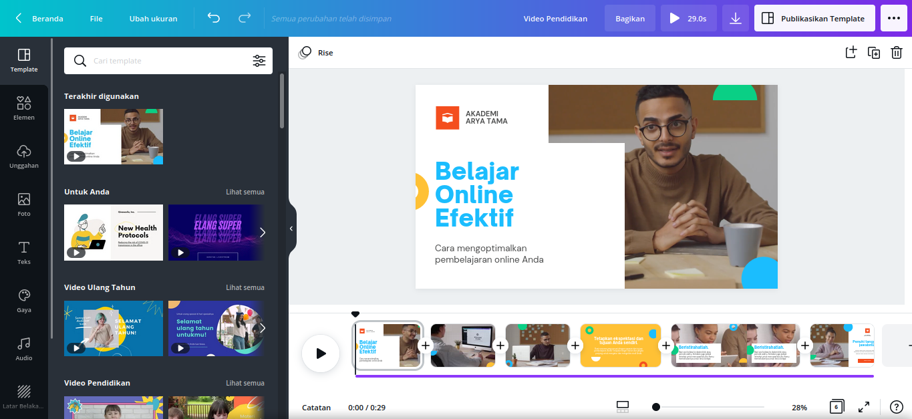
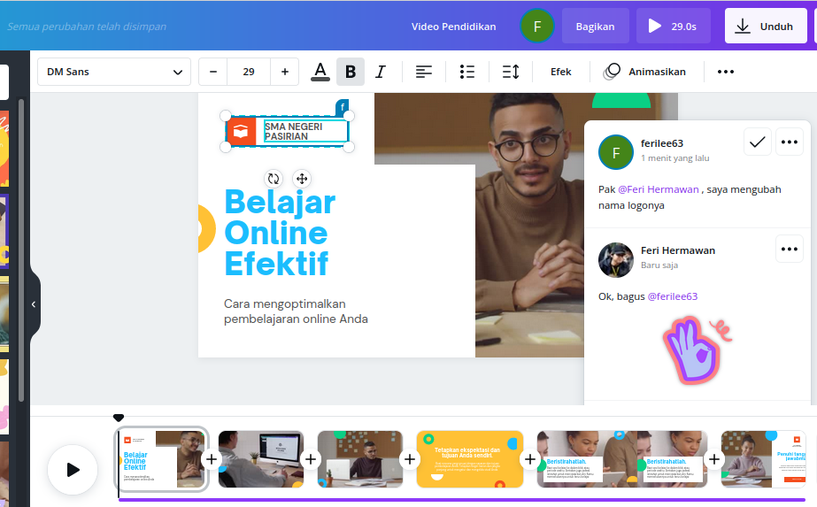

| MATERI | JAM PELATIHAN |
| :------: | :-----------: |
| Pengenalan Canva | 2 |
| Dasar - dasar Canva | 3 |
| Bermain dengan Teks | 4 |
| Elemen Canva | 4 |
| Video dan Animasi | 6 |
| Bekerja Kolaboratif | 5 |
| Tugas Proyek | 8 |
| Total | 32 |

## Pengantar
Konten visual sangat menunjang pemahaman siswa terhadap materi pembelajaran. Kualitas visual pada sebuah konten mempengaruhi belajar siswa. Oleh karena itu sebagai pengajar, kita dituntut untuk membuat desain media pembelajaran yang menarik dan mampu meningkatkan minat belajar siswa.

`Mengapa harus konten visual ?` Karena otak manusia memproses informasi lebih cepat melalui konten visual daripada teks. Konten visual dapat lebih cepat dipahami sedangkan teks membutuhkan waktu lebih lama untuk dibaca dan dipahami.

Anda tentu tidak asing lagi dengan aplikasi pengolah grafis seperti `Adobe photoshop, CorelDraw, Adobe Illustrator, Gimp, Inkscape`, dan lainnya. Namun sayangnya aplikasi-aplikasi berbasis desktop tersebut tidak cocok digunakan untuk pengguna awam yang tidak memahami konsep-konsep desain. Aplikasi-aplikasi ini menjadi senjata andalan para desainer profesional dalam menciptakan desain yang bagus dan keren.

Banyak pengembang aplikasi berlomba-lomba menciptakan alat bantu desain yang dibutuhkan oleh guru dan siswa untuk digunakan sebagai media yang mendukung proses pembelajaran baik di kelas maupun ***online class*** menggunakan LMS. Tidak hanya mudah dioperasikan, tetapi juga mampu dijadikan alat bantu desain yang kolaboratif dan mendukung pembelajaran.

Pada kesempatan kali ini, kita akan belajar membuat konten visual untuk pembelajaran dengan menggunakan Canva.
## Pengenalan Canva
Canva adalah alat bantu desain dan publikasi online dengan misi memberdayakan semua orang di seluruh dunia agar dapat membuat desain apa pun dan mempublikasikannya di mana pun.
Canva diluncurkan pada tahun 2013 dengan lebih dari 60 juta pengguna aktif bulanan yang tersebar di 190 negara dan mendukung 100 bahasa. Hingga saat ini, lebih dari 7 miliar desain telah dibuat oleh pengguna Canva.

Jenis konten visual yang bisa dibuat dengan Canva adalah
* logo,
* banner,
* poster,
* konten media sosial,
* invoice,
* infografis,
* newsletter,
* desain kemasan produk,
* iklan,
* presentasi,
* desain media pembelajaran,
* dan lain-lain.

## Dasar-dasar Canva
> **Langkah pertama**, sebelum memulai membuat desain di Canva, Anda harus membuat akun terlebih dahulu. Anda bisa membuatnya melalui `akun google, akun facebook, akun apple, atau surel (email)`.

>**Langkah kedua**, bergabung dengan tim melalui undangan yang dikirimkan via surel. Administrator telah membuat tim untuk bekerja bersama di Canva. Klik tombol `Gabung ke kelas` untuk mulai bergabung dengan anggota tim.

Setelah berhasil bergabung, Canva akan memberikan ucapan selamat bergabung seperti ini

>**Langkah ketiga**, untuk menciptakan konten visual Anda bisa memulai dengan tiga cara yaitu: ` mendesain dengan template, mendesain dari awal, mengunggah atau mengimpor PDF desain Anda.`
 

### Mendesain dengan template
Canva menyediakan ribuan template gratis siap pakai, mulai kategori pendidikan hingga bisnis. Anda hanya perlu mencari template yang sesuai dengan konten yang akan Anda buat.

Jika Anda sudah menemukan desain yang sesuai dengan keinginan, terapkan dengan menekan tombol `Sesuaikan template ini`.

Berikutnya Anda akan diarahkan menuju area kerja Canva seperti pada gambar di bawah ini

### Mendesain dari awal
Jika Anda menginginkan membuat desain baru dari awal, tentukan dimensi (ukuran desain yang diinginkan), kemudian klik tombol `buat desain baru`

### Mengunggah atau mengimpor PDF desain Anda
Fitur ini masih dalam tahap beta, sehingga masih belum optimal hasilnya. Disarankan untuk tidak menggunakan fitur ini sampai versi stabilnya. Jika Anda ingin mencobanya, silakan siapkan file PDFnya kemudian impor ke Canva.

### Bagian - bagian Canva
Bagian-bagian Canva bisa dilihat pada gambar berikut ini:

* tools (template, elemen, unggahan, foto, teks, gaya, audio, latar belakang, logo, lainnya). Canva menyediakan tools untuk Anda gunakan dalam membuat konten visual.

* Stage and timeline, pada bagian ini (stage) Anda akan melihat tampilan hasil dan timeline yang berfungsi untuk mengatur waktu desain tersebut muncul.

Seperti halnya pada presentasi, Anda bisa menambahkan efek transisi dan animasi halaman atau elemen untuk mempercantik tampilan.

## Bermain dengan Teks
Canva menyediakan beragam jenis font, mulai font reguler sampai kombinasi (*typography*). Anda boleh memilih jenis font yang disukai dan menggantinya dengan teks yang diinginkan.

## Elemen Canva
Selain teks, Canva juga menyediakan banyak elemen-elemen grafis seperti garis dan bentuk, audio, video, foto, bagan, bingkai, dan lain-lain.  

## Video dan Animasi
Canva memungkinkan untuk digunakan sebagai alat bantu desain yang berisikan konten video dan animasi. Canva menyediakan koleksi video dan animasi yang bisa Anda gunakan dalam karya Anda.

Apabila Anda tidak menemukan aset video pada koleksi Canva, Anda bisa mengunggah video pembelajaran melalui bilah unggahan.

## Bekerja Kolaboratif
Siapapun bisa bekerja secara kolaboratif di Canva. Setiap orang bisa mengubah desain untuk menghasilkan karya yang sempurna.

## Tugas Proyek
Silakan buat desain media pembelajaran sesuai mapel yang diampu dan kemudian diekspor dalam bentuk video dengan format mp4. Hasilnya diunggah ke media sosial (facebook, instagram, youtube, dan lain-lain).
